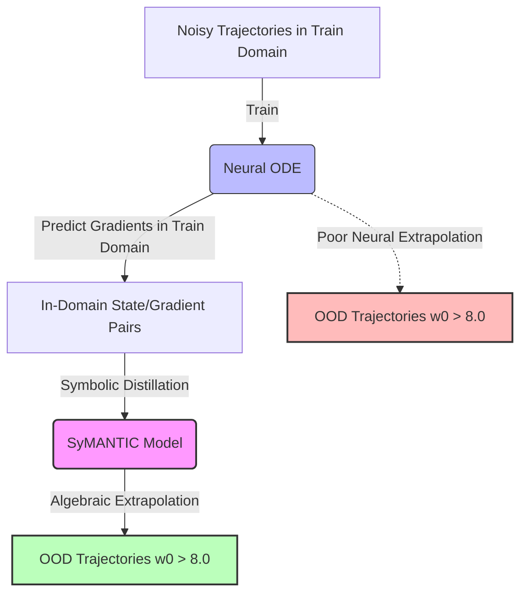

# Key Findings: Symbolic Extrapolation in Neural ODE Distillation

This document analyzes why distilled symbolic models (especially **SyMANTIC**) achieve excellent out-of-distribution (OOD) state extrapolation, even though they are trained using Neural ODE (NODE) gradients evaluated solely within the in-domain training region.

---

## 1. The Core Paradox
In our experiment:
* **Neural ODE (NODE)** models are trained on trajectories starting in the training range $w_0 \in [0.05, 8.0]$.
* **Symbolic Regression (SR)** models are fitted against the NODE's predicted gradients $\frac{dw}{dt}$ evaluated *only* at states within that same in-training region.
* **OOD Test Set** evaluates integration starting from $w_0 \in [8.0, 16.0]$.

Despite the NODE gradients being highly inaccurate in the OOD region (yielding $R^2 \approx 0.33$), the SyMANTIC distilled model extrapolates almost perfectly ($R^2 \ge 0.999$).

---

## 2. Why Symbolic Models Extrapolate So Well
The dramatic difference in extrapolation performance between the Neural ODE and the distilled symbolic model is explained by three main factors:

### A. Inductive Biases and Functional Constraints
* **Neural Networks (MLPs)** are local interpolators. They possess a "flat" or "arbitrary" inductive bias outside the convex hull of their training data. When queried in the OOD domain ($w > 8.0$), the MLP's output is governed by the weights of the final layers and the saturation behavior of its activations (like `nn.Tanh()`), leading to non-physical gradient predictions.
* **Symbolic Expressions** possess structure-preserving inductive biases. Instead of parameterizing a generic high-dimensional surface, SyMANTIC searches for a minimal algebraic expression built from basic operators ($+, \times, /, \text{pow}$). When SyMANTIC identifies the correct rational term $\frac{w}{w+1}$, the asymptotic behavior is defined by the algebraic structure itself:
  $$\lim_{w \to \infty} \frac{w}{w+1} = 1.0$$
  This algebraic property is mathematically guaranteed, meaning the model behaves correctly at large $w$ even without training data in that region.

### B. Curvature Information in the Training Window
Even though training is restricted to $w \le 8.0$, the *local geometry* (derivatives and curvature) within the training window contains enough structural information to uniquely determine the global function:
1. The rational term $\frac{w^2}{1+w^2}$ changes from quadratic-like growth near $w \approx 0$ to saturation near $w \approx 2.0$.
2. Inside the training range $w \in [0.05, 8.0]$, the transition from growth to saturation is fully visible.
3. Because the Neural ODE fits the clean training trajectories extremely well, its predicted gradients are highly accurate *within the training window*. 
4. SyMANTIC uses this clean, noise-filtered gradient dataset to determine the mathematical model. The local curvature of the NODE gradients is sufficient to select the rational operator $\frac{w}{w+1}$ over polynomials.

### C. Dissipative Dynamics and Self-Correction
The physical dynamics of the Spruce-budworm outbreak model assist the trajectory integration:
* The derivative is dominated by a negative quadratic term at large values:
  $$\frac{dw}{dt} \approx -0.05 w^2 \quad \text{as } w \to \infty$$
* This creates a strong **contractive force** (dissipative dynamics) that pulls any high out-of-distribution initial state ($w_0 > 8.0$) rapidly back down into the training domain ($w \le 8.0$).
* Once the trajectory enters the training domain, it is governed by the well-learned dynamics, suppressing accumulated integration errors.

---

## 3. SyMANTIC vs. SINDy Extrapolation
While both are symbolic, SyMANTIC outperforms SINDy under state extrapolation in this case:

| Feature | SINDy (Polynomial Library) | SyMANTIC (Feature/Rational Search) |
| :--- | :--- | :--- |
| **Functional Representation** | $\dot{w} = c_0 + c_1 w + c_2 w^2 + c_3 w^3$ | $\dot{w} = c_0 w + c_1 w^2 + c_2 \frac{w}{w+1} + c_3$ |
| **Extrapolation Risk** | High. High-degree polynomials diverge rapidly to $\pm \infty$ outside the training domain. | Low. Rational functions saturate or grow linearly, matching physical limits. |
| **Out-of-Distribution $R^2$** | $\approx 0.86$ | $\ge 0.999$ |

> [!IMPORTANT]
> This highlights the value of **non-linear feature selection** and **rational function search** in SyMANTIC: polynomials can easily overfit the local curvature inside the training window, leading to explosive divergence outside of it.

---

## 4. Key Takeaways for SciML Workflows
1. **Neural ODEs as Denoising Filter**: Neural ODEs are excellent at converting noisy time-series data into clean, continuous states and gradients.
2. **Distillation as Symbology Extraction**: Running Symbolic Regression on the NODE's *in-domain* gradients is a highly effective way to discover the true underlying physical equation.
3. **Guaranteed Extrapolation**: The resulting algebraic equation inherits the global mathematical properties of its constituent functions, ensuring robust out-of-distribution extrapolation that neural networks cannot match.
